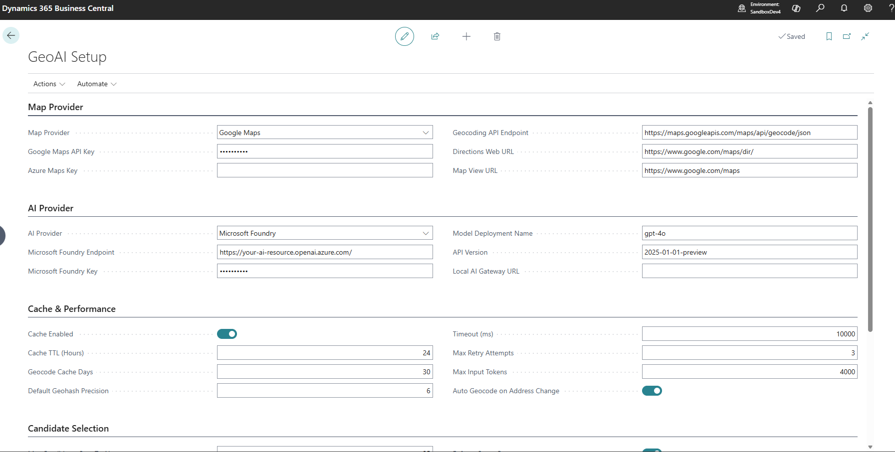
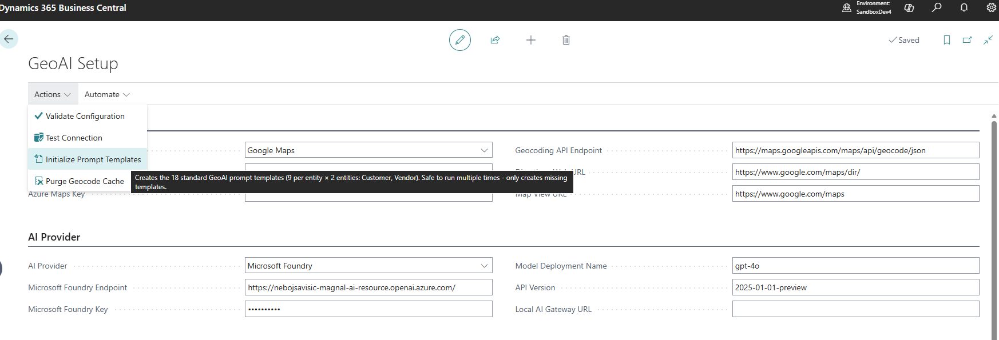
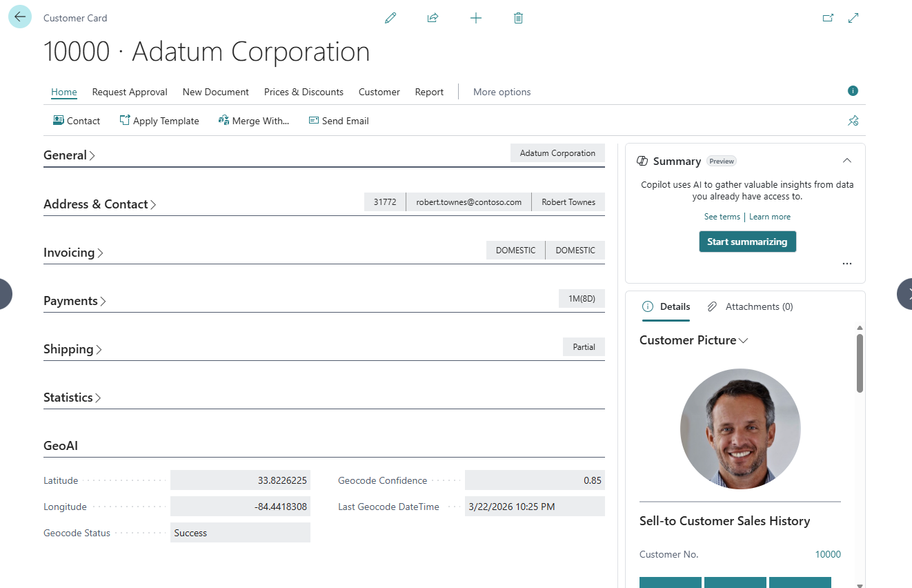
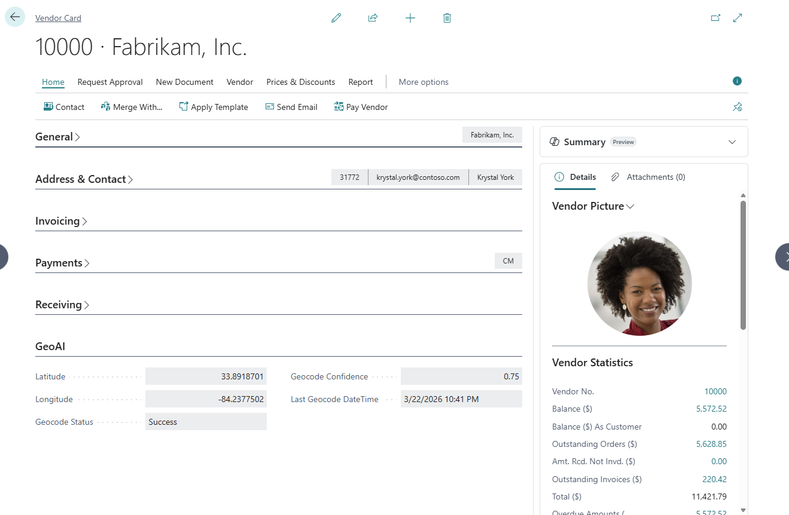
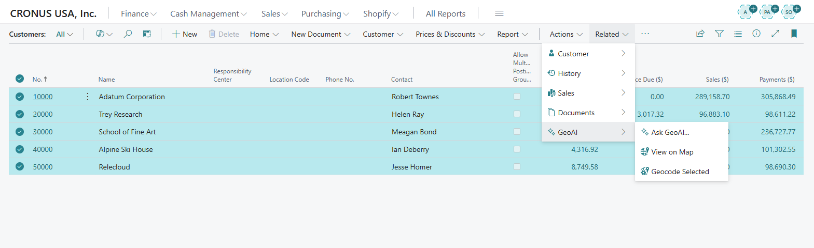
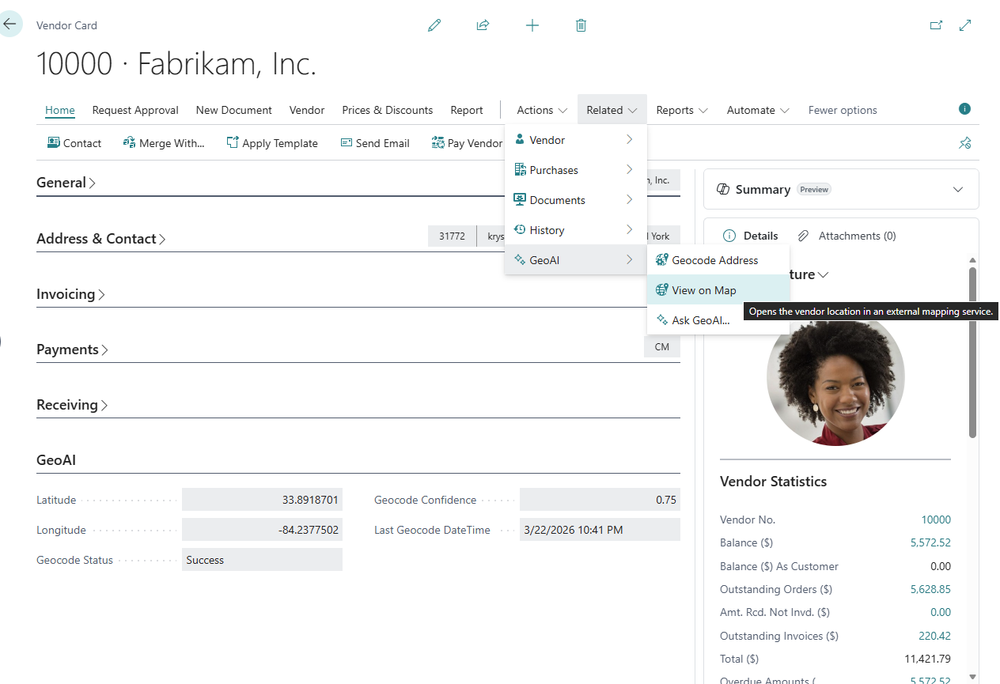
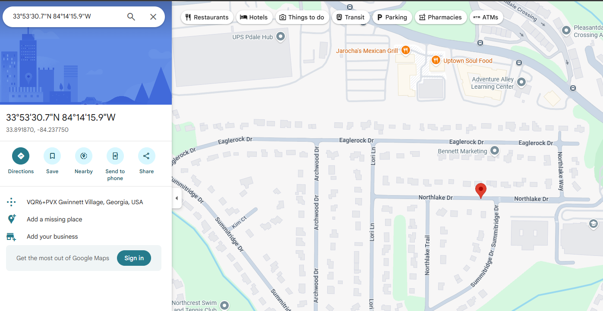
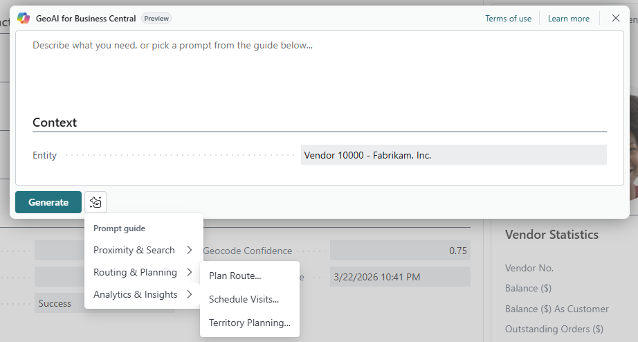
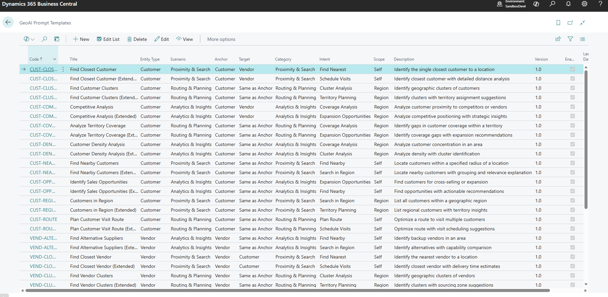

# GeoAI OSS

GeoAI OSS is an open-source Microsoft Dynamics 365 Business Central extension that adds geocoding, map links, and AI prompt capabilities for **Customers** and **Vendors**.

- **Map providers**: Google Maps, Azure Maps
- **AI provider**: Microsoft (Azure) AI Foundry via an Azure OpenAI–compatible chat completions endpoint

> The OSS scope focuses on Customer/Vendor scenarios and cloud-ready setup.

## What you get

- Geocode and reverse-geocode addresses (lat/long + confidence)
- Distance matrix support (provider dependent)
- Cached geocoding results to reduce external calls
- Map hyperlinks (single point and multi-point directions)
- “Ask GeoAI” prompt experience based on prompt templates
- Basic telemetry hooks (can be disabled in setup)

## Compatibility

- Target: **Business Central online** (app target is `Cloud`)
- Application: **27.0.0.0** (see `app.json`)
- Uses the **System.AI** namespace for chat completions (`Azure OpenAI` codeunit), so a BC version that includes these capabilities is required.

## Configuration (GeoAI Setup)

Open the **GeoAI Setup** page and configure:

### Map provider

- **Map Provider**: `Google` or `Azure`
- **Google Maps API Key** (if Google)
- **Azure Maps Key** (if Azure)
- Optional URL overrides:
  - **Maps Endpoint URL** (geocoding endpoint)
  - **Maps Directions URL** (web directions base URL)
  - **Map View URL** (web map base URL)

### AI provider (Microsoft Foundry)

- **AI Provider**: `Microsoft Foundry`
- **Microsoft Foundry Endpoint**
- **Microsoft Foundry Key**
- **Model Deployment Name**
- **API Version**

> Important
> For the **Ask GeoAI** prompt experience that uses Business Central `System.AI` and the `Azure OpenAI` codeunit, configure the endpoint in this format:
>
> `https://your-resource.openai.azure.com/`
>
> Do not use:
>
> `https://your-resource.cognitiveservices.azure.com/`
>
> The direct **Test Connection** call may still work with an Azure OpenAI-compatible chat completions endpoint, but the Business Central `System.AI` prompt execution path expects the Azure OpenAI `.openai.azure.com` base URL. Using the Cognitive Services endpoint can cause prompt execution to fail with an authorization error before the request reaches the model.

### Optional behavior

- **Cache Enabled**, **Cache TTL/Retention**
- **Auto Geocode on Address Change** (clears GeoAI fields when address changes)
- **Enable Telemetry**
- **Redaction Level** (configuration exists to control masking expectations for outbound AI payloads)

Use **Test Connection** in GeoAI Setup to verify the Foundry endpoint from within Business Central.

The setup page keeps map settings, AI settings, cache behavior, and retry settings in one place.

On a new installation, run **Initialize Prompt Templates** once to load the default prompt library.

## Usage

### 1. Open a customer or vendor

GeoAI fields are shown directly on the card, including latitude, longitude, geocode confidence, and status.

#### Customer example

#### Vendor example

### 2. Geocode one or more records

From customer or vendor pages, use the **GeoAI** actions to geocode addresses. On list pages, you can geocode multiple selected records at once.

### 3. Open the resolved location on the map

After a record is geocoded, use **View on Map** to open the configured map provider with the saved coordinates.

The external map opens with the resolved point.

### 4. Ask GeoAI

Use **Ask GeoAI** from the GeoAI actions to run geographic prompts for the current customer or vendor.

### 5. Review the available prompt templates

GeoAI OSS includes ready-to-use prompt templates for proximity search, routing and planning, and analytics scenarios.

## Architecture

### 1) Reference architecture: Business Central ↔ Microsoft Foundry

| Phase | Component (BC + Foundry) | What happens in GeoAI OSS |
|---|---|---|
| 1. Initiation | Business Central UI (AL) | User triggers “Ask GeoAI” / GeoAI operation; BC validates `GeoAI Setup` configuration. |
| 2. Prompt build | `GeoAI Prompt Engine` + `GeoAI Prompt Template` | Template text is loaded and context JSON is injected into the user prompt (placeholder replacement). |
| 3. Provider binding | `GeoAI Client` → `GeoAI Service (AOAI)` (`System.AI`) | BC selects the AOAI-backed implementation (`IGeoAI Service`) and sets token/temperature parameters from setup. |
| 4. Auth & transport | `Azure OpenAI` codeunit (System.AI) over HTTPS/TLS | BC sets the Copilot capability, stores authorization (endpoint + deployment + api-key), then sends the chat completion request securely. |
| 5. Reception & execution | Microsoft (Azure) AI Foundry endpoint | Foundry receives an Azure OpenAI–compatible chat completions request and executes the model deployment. |
| 6. Response handling | `GeoAI Service (AOAI)` | Result is read from the last assistant message; retry with exponential backoff is applied on failures; errors are surfaced via BC error handling. |
| 7. Observability | Telemetry (`Session.LogMessage`) | Success/failure, duration, status and estimated token usage are logged when telemetry is enabled. |

Notes:
- GeoAI OSS also includes a **direct HTTP test call** (`GeoAI HTTP Client`) used by **GeoAI Setup → Test Connection**, which posts to a deployment-style endpoint: `/openai/deployments/{deployment}/chat/completions?api-version={version}` with `api-key` header.

### 2) Full integration: Business Central → Microsoft Foundry + Map provider

| Capability | Business Central components | External service | Protocol / API style | Output used in BC |
|---|---|---|---|---|
| Geocode address → coordinates | `GeoLocation Mgmt` + `GeoAI HTTP Client` + entity table extensions | Google Maps *or* Azure Maps | HTTPS GET with query params (`address`/`query`) + provider API key | Latitude/Longitude + confidence; stored on Customer/Vendor and optionally cached (`GeoAI Geocode Cache`). |
| Reverse geocode coordinates → address | `GeoLocation Mgmt` + `GeoAI HTTP Client` | Google Maps *or* Azure Maps | HTTPS GET with `latlng` / `reverse` endpoint | Resolved address text; optionally cached. |
| Distance matrix | `GeoLocation Mgmt` + `GeoAI HTTP Client` | Map provider | Provider-specific matrix endpoint | Returned matrix JSON for downstream logic/UI. |
| AI prompt execution | `GeoAI Prompt` UI + `GeoAI Client` + `GeoAI Service (AOAI)` | Microsoft (Azure) AI Foundry | HTTPS chat completions via `System.AI` (Azure OpenAI compatible) | Structured/freeform text used by the UI (e.g., prompt results, guidance). |
| Map experience | `GeoAI Map URL Formatter` + result pages | Browser-based map UI | URL formatting (single point / multi-point directions) | Opens map links for the geocoded coordinates. |

## Repository layout (high level)

- `src/Setup/` setup table/page, enums, permission set
- `src/Core/` geocoding, caching, HTTP client, map URL formatting
- `src/AIEngine/` prompt templates, prompt engine, Foundry/AOAI service wrapper
- `src/EntityExtensions/` Customer/Vendor field & UI extensions
- `src/UI/` GeoAI pages for prompt/results

## Security & privacy notes

- API keys are stored in setup fields using masked datatypes.
- All calls to external services use HTTPS/TLS.
- Review your organization’s policies before sending any business data to external AI or map services.

---